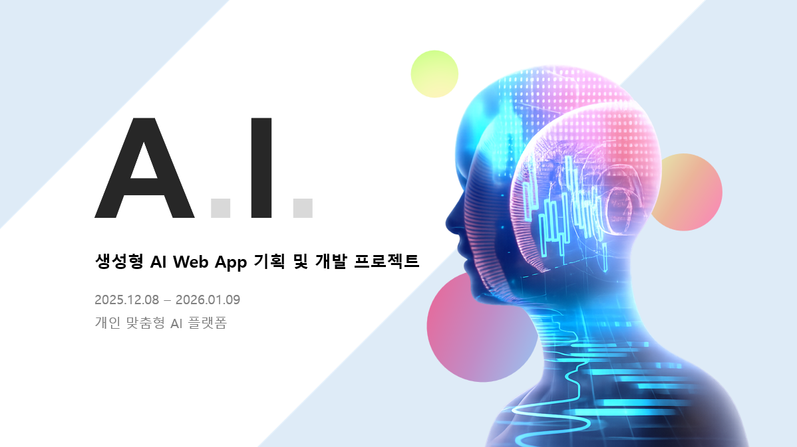
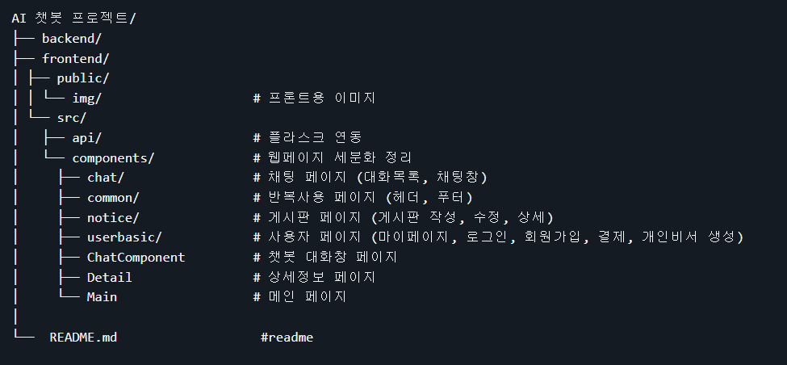
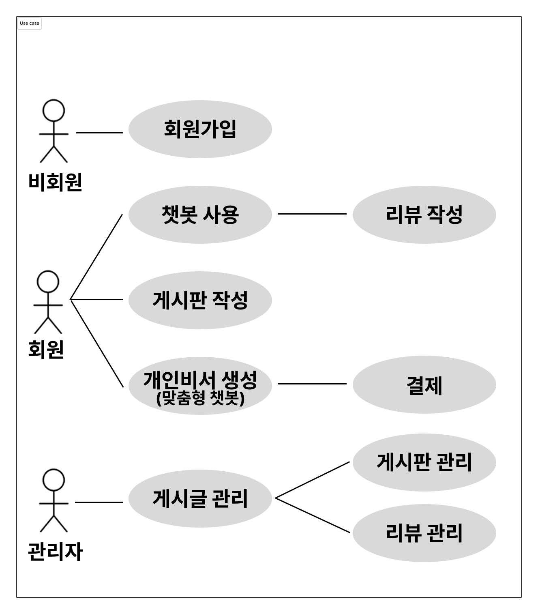
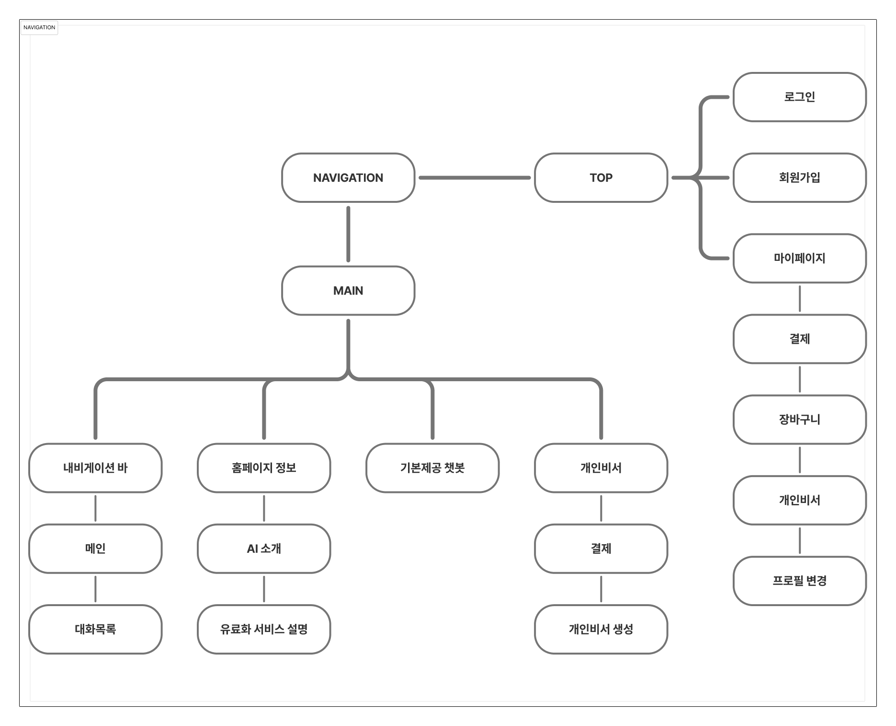

## 💫 AI Web App Team Project
생성형 AI Web App 기획 및 개발 - 개인 맞춤형 AI 플랫폼

## 🕒 개발 시간
2025/12/08 ~ 2025/01/09 (약 4주간)

## 🤝 같이 개발한 팀원들
🐧 이상수 : 팀장(바지) 
🐣 김태연 : 프론트엔드(react) 
🦒 백기림 : 백엔드, DB, AI 
🐶 이기화 : AI  
🐸 지수정 : 프론트엔드(react)

 

## 📜 프로젝트 소개
**특정 파트에 최적화 된 AI를 제공하는 플랫폼** 
역할별로 분리된 AI 설계를 통해, 각 기능 영역에서 일관된 응답 품질을 유지합니다. 
사용자는 목적에 맞는 AI와 상호작용하며, 단순한 질의응답을 넘어 지속적인 AI 경험을 제공합니다.

 

## 🌞프로젝트 구조

AI 챗봇 프로젝트

 

 

## 📢 기획 의도
개인비서 AI는 단순한 기능 구현보다, 
서비스 구조와 사용자 흐름에 대한 설계가 중요하다고 판단했습니다.
  
이에 따라 본 프로젝트는 
AI 채팅을 중심으로 한 기본 서비스 흐름을 먼저 구현하고, 
개인비서 기능은 향후 확장이 가능하도록 구조를 설계하는데 중점을 두었습니다.
  
이를 통해 실제 서비스로 발전시킬 수 있는 기반을 마련하고자 했습니다.

 

## 📚 개발환경
<b>→ Frontend</b>: React, JavaScript, React-Bootstrap  
<b>→ Backend</b>: Flask, Python, SQLAIchemy  
<b>→ Auth</b>: LocalStorage 기반 인증  
<b>→ AI</b>: OpenAI 외부 API 인증  
<b>→ DB</b>: SQLite (개발 환경)  
<b>→ Infra</b>: Docker, Nginx  
<b>→ Tool</b>: VS code, PyCharm, Figma, Notion, GitHub

 

## 📚목차📚
01. 📐 [Diagram](#-diagram)
02. 🖥 [화면구현](#-화면구현)
03. 🔎 [주요기능](#-주요-기능)
04. 🎬 [기능 실행화면](#-기능-실행화면)
05. 📂 [프로젝트 보고서](#-프로젝트-보고서)
06. 📚 [향후 개선 및 추가 기능](#-향후-개선-및-추가-기능)
07. 🧩 [문제 해결 사례](#-문제-해결-사례)
08. 🚀 [프로젝트 회고](#-프로젝트-회고)
09. ⚙️ [참고 자료](#️-참고-자료)

 

## 📐 Diagram

UseCase

 

Navigation

 

 

## 🖥 화면구현

메인페이지

 

회원가입

 

로그인

 

마이페이지

 

결제페이지

 

대화 목록

 

대화 리뷰

 

AI 대화창

 

게시판

 

게시판 작성

 

 

## 🔎 주요 기능

메인 페이지

 

1. 서비스 소개 및 컨셉 전달 
2. 멤버십 핵심 혜택 안내 
3. AI 카테고리 진입 허브 (Basic Category) 
4. 멤버십 전용 개인비서 슬롯 제공 
5. 공지 및 커뮤니티 접근

로그인/회원가입

 

1. 아이디/비밀번호 로그인 및 로그인 상태 유지(토큰/세션 기반) 
2. 카카오/네이버/구글 간편 로그인 UI 제공 
3. 회원가입 폼 + 닉네임/이메일 중복확인 
4. 필수/선택 약관 동의로 가입 플로우 완성

AI 플랫폼 대화

 

1. 사용자 닉네임을 반영한 개인화된 AI 가이드 제공 
2. 기술/프로그래밍 질문에 특화된 대화 흐름 설계 
3. 실시간 채팅 UI를 통한 연속 대화 지원 
4. JWT 토큰 인증 기반 사용자 접근 제어

대화 목록

 

1. 로그인 사용자 기준 AI 대화 목록 조회 
2. 대화 선택 시 우측 영역에 대화 내용 표시 
3. 대화 미선택/기록 없음 상태에 대한 안내 UI 제공 
4. 좌/우 분할 레이아웃으로 채팅 앱 형태 UX 구현

마이페이지

 

1. 사용자 닉네임 및 잔액 정보 표시 
2. 개인비서 슬롯 관리 및 멤버십 전용 기능 제공 
3. 닉네암/비밀번호/프로필 이미지 변경 
4. 멤버십 상태 확인 및 해지 기능 
5. 회원 탈퇴 등 계정 관리 기능 제공

결제 및 멤버십

 

1. 충전 금액 선택을 통한 코인 충전 기능 
2. 카드/카카오페이/네이버페이/토스페이 결제 수단 제공 
3. 결제 전 유의사항 및 충전 후 예상 코인 표시 
4. 결제 완료 후 잔액 반영 흐름 구성

게시판

 

1. 게시글 목록 조회 및 공지글 메인페이지 하단 고정 
2. 페이지네이션을 통한 게시글 탐색 
3. 이미지 첨부, 태그, 가격 입력을 포함한 게시글 작성 
4. 로그인 사용자 기준 게시글 작성 및 관리 

## 🎬 기능 실행화면

🔐 인증 & 계정 관리

- 회원가입 / 로그인 (JWT 기반 인증) 
- 마이페이지 정보 수정 및 멤버십 관리

[로그인&회원가입](./videos/회원가입,로그인.mp4)  
[마이페이지](./videos/마이페이지%20구현.mp4)

🤖 AI 플랫폼 대화

- 역할별 AI 비서와 실시간 대화  
- 사용 제한 및 예외 상황 처리

[AI챗봇대화실행](./videos/챗봇%20답변.mp4)

※ 예외처리 시나리오  
[챗봇답변거절멘트](./videos/챗봇%20답변%20거절멘트.mp4)  
[사용횟수초과시처리](./videos/챗봇%20사용횟수%20초과시.mp4)

📂 대화 기록 관리

- 이전 AI 대화 목록 조회  
- 대화 선택 기반 화면 전환

[이전대화목록확인](./videos/이전%20대화목록%20확인.mp4)

💳 결제 & 멤버십

- 코인 충전 및 결제 수단 선택  
- 결제 결과에 따른 잔액 반영

[결제페이지실행](./videos/결제페이지.mp4)

🎥 게시판 & 리뷰

- 게시글 조회, 작성, 삭제  
- 리뷰 작성 및 관리

[게시판기능실행](./videos/게시판%20상세.mp4)

- [게시글작성](./videos/게시글%20작성.mp4)
- [게시글삭제](./videos/게시판%20삭제.mp4)
- [리뷰작성및삭제](./videos/리뷰%20작성,%20삭제.mp4)

 

## 📂 프로젝트 보고서

 

## 📚 향후 개선 및 추가 기능
- 챗봇 결제 페이지 생성 및 결제하면 바로 사용할 수 있도록 구현
- API 제공시 불필요한 정보를 제한함으로써 속도 개선
- 커스텀 챗봇 페이지 생성 및 프롬포트 직접 수정 작성 가능하도록 도전
- 기본 챗봇 프롬포트 수정 필요로 함/ 너무 제약이 크거나 학습된 챗봇이 아닌 룰을 따르는 챗봇이라 수정 필요
 

## 🧩 문제 해결 사례

 

## 🚀 프로젝트 회고
- 🐧:     
- 🐣:     
- 🦒:     
- 🐶:     
- 🐸:
 

## ⚙️ 참고 자료
- [마켓컬리](https://event.kurly.com/lego/event/2023/0911/join/coupon?%243p=a_custom_1311603463982995667&~agency_id=284&%24deeplink_path=open%3Furl%3Dhttps%253A%252F%252Fevent.kurly.com%252Flego%252Fevent%252F2023%252F0911%252Fjoin%252Fcoupon&%24android_passive_deepview=false&%24ios_passive_deepview=false&~tags=1055&~campaign=21533696829&~ad_set_name=189689558144&~keyword=%EB%A7%88%EC%BC%93%EC%BB%AC%EB%A6%AC&gad_source=1&gad_campaignid=21533696829&gbraid=0AAAAADM2qzIwvvbh32WXMA6YPDBHllFdC&gclid=CjwKCAiAvaLLBhBFEiwAYCNTf2n8O7DtvreyUWjT4o8T3_wFd_eW8i9S6kMhI9RLexajLcUTqBlGCBoCjYYQAvD_BwE&_branch_match_id=1491949500452214886&_branch_referrer=H4sIAAAAAAAAA32R246bMBCGn8ZcJmADgUpWxSG0qyY9ZpXmynLAAXOwWUNg0wuevYZN1EqV6ovR7xnP%2FJ%2FGRd%2B33bv1urqq%2BraibbuquajW7wG0UYspSa9dLxtiIctyTWS7yPeg7zuuuzEmmjOR3gjPMPRsQ3dkjLVzO2lpX2DZMgFQogcDFBezD4AOCnSAyRLYwES%2FenNOZbPkapbLP8VFQROiRZi%2BZS2ilFwsIpXXVorZmopMSZ5p567jAyMzysDZiC%2B07tj8gsvuP1Ut6jNNK6Jp8BvsjKpB%2F8W8Qz4Q74B3vDvcA23qad5hy3QcY0pp01KeCwwtByHXd%2FUq9RYz0rGeCNowbHk66TuOZ9m2MVXsNkqVYbANQbABnge2EQgj4KNF6GS0lFwtjHyeI68q1VOWy8Nt%2Fp6%2F%2FPKzojplBvOJ9%2FDl19M4DOcCwePPfeCevsbhx7pOMj0xrfXDqBw%2FRQEPBrrbhUWYbPkYnKLPhwsU3pdN3A%2BK3Z6P5cGW3gGRMckIO3rc%2F%2BFW%2B%2BLJ%2F75jr7Tcpc%2BHl7D%2BEIUyKk%2Bnb8EQk3DcGpNiF6YUFzk5Kzl2TOGoULJhvwHjHvfBlgIAAA%3D%3D)  
- [ChatGPT](https://chatgpt.com/?utm_source=google&utm_medium=paidsearch_brand&utm_campaign=GOOG_C_SEM_GBR_Core_CHT_BAU_ACQ_PER_MIX_ALL_APAC_KR_KO_120624&utm_term=%EC%B1%97%20gpt%20%EC%B1%97%EB%B4%87&utm_content=183521101147&utm_ad=756128607757&utm_match=p&gad_source=1&gad_campaignid=21990694068&gbraid=0AAAAA-IW-UV6gwZey_2ZG2tIndrVp-ve_&gclid=Cj0KCQjwuKnGBhD5ARIsAD19RsYg1bc8H7KJPSNXjdtRlqtaMcDz_eHbzmnWWot_9tRWTJl5dlWU_9YaAgXMEALw_wcB)

